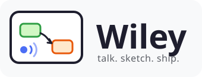
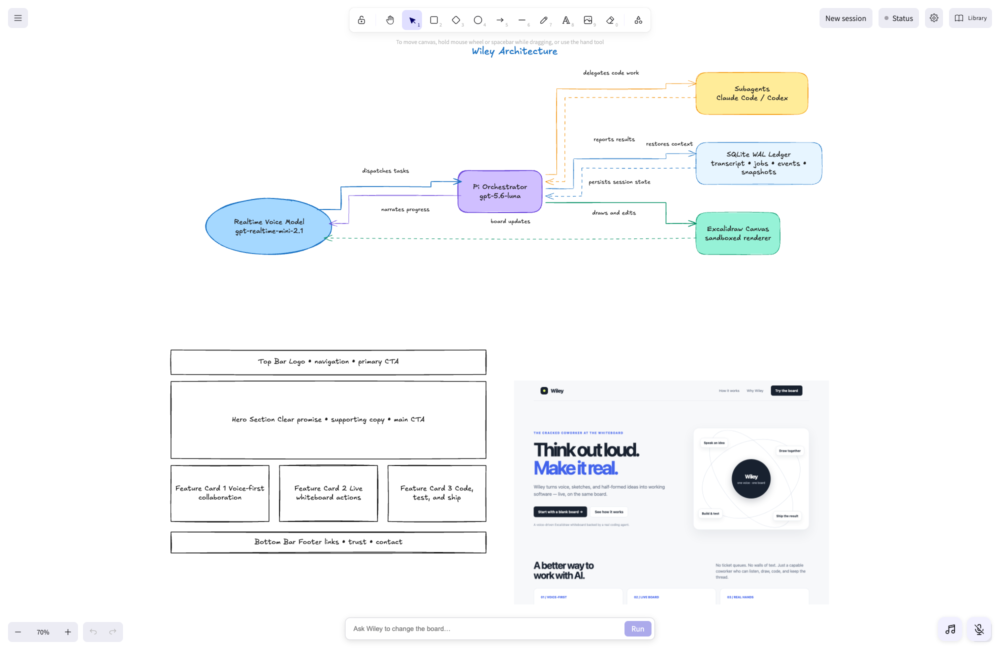
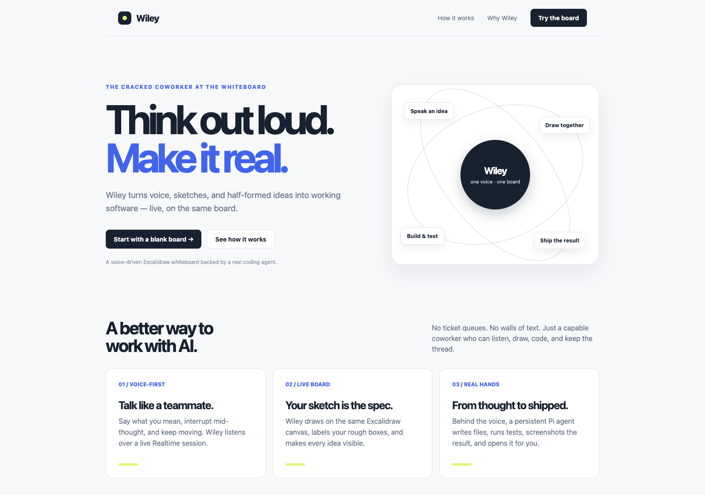

**The cracked coworker at the whiteboard, with a laptop.**  
You talk and sketch. Wiley draws, codes, runs, and ships, live, on the same board.


---

Chat windows made AI feel like a ticketing system: type a request, wait, read a wall of text. Wiley is a different interaction model. It is the colleague you grab a whiteboard with. You think out loud, half-draw an idea, say "connect that to the voice thing", and it happens, while the same colleague quietly opens a laptop, writes the code, runs the commands, and pins a screenshot of the result next to your sketch.

One voice, one board, real hands.



One unedited board from the automated end-to-end scenario: Wiley drew the architecture diagram, labelled a hand-drawn six-box wireframe without touching the sketch, built the site from it, and pinned the rendered screenshot beside the drawing.

## What a session feels like

- "Draw how this project works." A validated, ELK-laid-out diagram grows on the board in front of you: sized nodes, distributed connector ports, labels that never sit on top of each other.
- You sketch six rough boxes and say "that's a landing page, fill it in." Wiley labels **your** rectangles. It does not clear your board. It does not redraw your sketch. Your drawing is the spec.
- "Build it." Wiley writes the site, screenshots it headlessly, and places the screenshot on the board next to your wireframe.
- "Open it." It runs `open site/index.html`. Your browser appears with the real page.
- "What have you done so far?" It actually knows: current work, queued work, and the final report of every recent task.
- Want the keyboard back? Hand the running coding session to your own terminal and pick it up mid-thread in Terminal, iTerm, Warp, Ghostty, kitty, or Alacritty, same session id, same working directory, same context.
- When the diagram is done, Wiley talks you through it: what flows where and why.
- Done with a topic? Say "fresh board" (or hit the New session button) and you get a clean board and a clean working memory in one step. The old session stays archived in the ledger.

Wiley works out loud. It narrates what it is reading, what it just learned, and what it is about to draw, so the quiet stretches never feel dead. It draws the way a person does: a rough version early, refined as understanding builds, and anything proven wrong gets erased or corrected on the spot. You watch the picture converge instead of waiting for a reveal.

The whole time, you can interrupt mid-sentence. Interruption is the default at every layer: your voice interrupts the orchestrator, the orchestrator interrupts its workers, and everyone verifies what their half-finished action actually did before continuing. Pile on corrections as fast as you can speak them and the delivery lock guarantees none get dropped.



Wiley's own work: the landing page it designed, wrote, screenshotted, and opened, starting from six hand-drawn rectangles. Copy included.

## Why this is different

**The board is shared ground truth, not a render target.** Humans and agents edit the same Excalidraw scene through a serialized transaction gateway with revision checks and leases. Human edits win conflicts. The agent can move, resize, recolor, relabel, and connect your hand-drawn elements as first-class citizens, and every mutation lands as a coherent undo step.

**Drawing quality is engineered, not prompted.** Diagram layout runs through ELK with node sizes measured in the actual rendered font, connector ports spread by edge degree, and edge labels placed in reserved space. An eleven-check quality evaluator runs in production on every drawn diagram, twice: once on the plan and again on the converted Excalidraw scene, because bound labels and arrow bindings move during conversion.

**The picture stays a picture, not a redraw.** Six themes and seven node roles keep a diagram coherent, with label ink auto-chosen for 4.5:1 contrast against whatever it sits on. Nodes group into labelled containers and real Excalidraw frames, nesting up to two levels deep. `update_diagram` evolves a diagram in place: element ids are derived from the graph, so a diff falls out of set arithmetic and survivors tween to their new positions while additions fade in and removals fade out. And `tidy_diagram` straightens **your** sketch without ever replacing it, snapping sizes to the grid, evening out spacing, moving captions onto their shapes, and giving freehand arrows real bindings. Every element keeps its id, its colors, and its text. Only geometry moves.

**The agent has real hands.** Behind the voice sits a persistent [Pi](https://github.com/earendil-works/pi) orchestrator with full read, bash, edit, write, grep, find, and ls tools plus up to four parallel subagent sessions, all sharing the canonical conversation and the board. It codes, tests, screenshots, and opens things on your machine.

**It can also hire.** For heavier code work Wiley drives the CLIs you already have logged in: Claude Code and Codex. Those workers are code-only, with no board access and no way to speak; they take a task, they can be steered mid-run, and they report back.

**Safety without ceremony.** A hard guard unconditionally blocks catastrophic destruction (home, root, disks, credential stores, fork bombs). Above it, a cheap approval model reviews risky bash, edit, and write calls against your recent spoken requests, fails open, and announces every block out loud so you hear "I stopped myself" in real time. Blocked agents must escalate to you by voice; they are forbidden to retry or work around it.

**Your models, your keys.** A settings panel picks the voice model, the voice itself, the orchestrator model, the model background work runs on, and the reviewer model, plus an allowlist naming exactly which models background work may spawn. Your OpenAI key is stored through the OS keychain and never reaches a browser tab.

**One persona.** Voice model, orchestrator, and subagents present as a single coworker. Progress is first-person, at most one short sentence, and never narrates internal machinery.

## Architecture in one breath

A Realtime model (`gpt-realtime-2.1-mini` by default) handles ears and mouth over WebRTC. Its whole manifest is six tools: dispatch a task, answer the agent, ask for status, abort, start a fresh session, and take a read-only look at the board. Every real action flows through the root Pi session (`gpt-5.6-luna`, low thinking while fast mode is on), which owns coding tools, board tools (`draw_diagram`, `update_diagram`, `tidy_diagram`, `connect_shapes`, `edit_canvas`, `place_image`, ...), subagents, the Claude Code and Codex workers, and the safety stack. A SQLite WAL ledger persists the transcript, jobs, agent events, and board snapshots. The renderer is a sandboxed Excalidraw surface; the silent `[board update]` channel keeps the voice model passively aware of what you just drew, so "connect these two" simply resolves.

## Run it

Requirements: Node 24+ (the ledger uses `node:sqlite`, unflagged from 23.4) and an OpenAI API key with access to the configured models. The Electron shell and packaging want macOS Apple Silicon; the browser shell runs anywhere Node does. Claude Code and Codex are optional: install and log in to either CLI and it shows up as an available worker.

```bash
cp .env.example .env   # set OPENAI_API_KEY
npm install
npm run dev:web        # browser shell at http://localhost:5173
```

For the Electron shell, run `npm run dev` instead of the last line. For a real app bundle rather than a dev server, see the packaging table below.

**Wiley opens a project.** Launching it means choosing a folder: the first launch shows a picker with a native Open Folder button and the projects you have opened before, and every launch after that reopens the last one without asking. Switch at any time from File → Open Project (⌘O), File → Open Recent, or the project chip in the top-right of the board; the switch happens in place, with no restart. Everything Wiley reads, writes and runs stays inside the folder, and the folder carries its own history: boards, sessions and transcripts live in `<project>/.wiley/runtime.sqlite`, so reopening a project brings its board back with it. The first project opened after upgrading from a version that kept one shared ledger adopts that history, and the original is left renamed beside it rather than deleted; if that first project already has a ledger of its own, the shared one stays in the app's data directory untouched. The browser shell still serves the single project it was started in.

Your OpenAI API key never leaves the main process. The renderer receives only a short-lived Realtime client secret scoped to the voice session. Keys entered in the settings panel are stored through the OS keychain when it is available, and a `0600` file otherwise. Pi can also use credentials already configured in `~/.pi/agent/auth.json`.

A word on signing: `package.json` pins the Developer ID identity to the maintainer's certificate, so `npm run package:mac` only works on a machine holding it. Build with `npm run package:mac:unsigned`, or point `CSC_NAME` at your own identity. Notarizing needs your own Apple credentials either way.

> **The browser shell binds loopback for a reason.** Its local API is unauthenticated: anything that can reach the port can drive the agent, read the board, and spend your key. It listens on `127.0.0.1` by default. Do not put it on `0.0.0.0`, a tunnel, or a LAN address, and do not set `WILEY_ALLOW_REMOTE_SECRETS`.

Optional settings, for the cases the panel does not cover:


| Variable                                     | Effect                                                                                                       |
| -------------------------------------------- | ------------------------------------------------------------------------------------------------------------ |
| `WILEY_PROJECT_DIR`                          | Project folder the coding tools may edit; overrides the picker and the last project opened                   |
| `WILEY_DATA_DIR`                             | Ledger directory for the project opened at launch; anything opened after it keeps its own `<project>/.wiley` |
| `WILEY_CONFIG_DIR`                           | Where `settings.json` and the secret store live                                                              |
| `VOICE_DISABLED=1`                           | Keeps Realtime offline and shows a text input for harness testing                                            |
| `WILEY_APPROVAL_MODEL`                       | Reviewer model for risky tool calls (default `gpt-5.6-luna`; `gpt-5.6` family only)                          |
| `WILEY_APPROVAL_DISABLED=1`                  | Disables the reviewer; the catastrophic guard always stays on                                                |
| `WILEY_HOST`, `WILEY_PORT`, `WILEY_WEB_PORT` | Browser shell bind address and ports; read the warning above first                                           |


The full list, including the end-to-end and packaging variables, is in `[.env.example](.env.example)`.

Everything else is in the settings panel. The persistent controls on the board are the microphone button in the bottom-right, and the project chip, settings and new-session buttons in the top-right. Muting stops capture only; background work continues.

**Wiley Cloud.** The app supports a relay mode: point it at a relay base URL, sign in with a token, and models are proxied instead of billed to your own key. The relay service itself is a separate piece of infrastructure and still in progress. Bring-your-own key is the default and the supported path, and cloud mode never silently falls back to your own key when the relay fails.

## Verify and package

```bash
npm run typecheck
npm test               # 1000+ unit and layout-stress tests, real font metrics, no tokens
npm run lint
npm run build
npm run package:mac    # signed arm64 DMG in release/
```

CI runs those first three on every pull request and every push to `main`, then `npm run build` on macOS behind them.

Packaging targets, all arm64 DMG in `release/`:


| Command                         | Result                                                                                                   |
| ------------------------------- | -------------------------------------------------------------------------------------------------------- |
| `npm run package:mac`           | Signed with the Developer ID identity pinned in `package.json`, or whatever `CSC_NAME` names             |
| `npm run package:mac:notarized` | Also submitted to Apple and stapled; needs your own notarytool credentials exported (see `.env.example`) |
| `npm run package:mac:unsigned`  | No signing at all: the one that works on any Mac                                                         |


## Runtime boundaries

The renderer is sandboxed with no Node access; it owns WebRTC audio and Excalidraw rendering. The Electron main process owns credentials, the ledger, Pi sessions, job interruption, safety guards, and the serialized board transaction gateway. The Realtime capability manifest contains no shell, filesystem, git, or subagent-spawn tool, and no way to draw. Its one destructive power is starting a fresh session, which is a thing you ask for out loud.

Implementation details and the deterministic/real-model test matrix: [docs/pi-harness-guide.md](docs/pi-harness-guide.md) and [docs/agent-test-procedure.md](docs/agent-test-procedure.md).

## Where it came from

Wiley won the internal hackathon of [Null Fellows](https://www.nullfellows.com) Cohort 02, a cohort of 35 selected from over 3000 applicants. The program places young European builders into top startups.

Built with [Akshith Alluri](https://github.com/aalluri-byte), [Noel Matero](https://github.com/NoelMatero), and [Bendik Norli](https://github.com/bendiknorli).

The thing we were actually chasing: make collaborating with an AI agent as seamless as collaborating with a genius friend at a whiteboard.

## Contributing and license

Setup, the verify commands, and a map of the modules: [CONTRIBUTING.md](CONTRIBUTING.md).

Apache-2.0. See [LICENSE](LICENSE).
